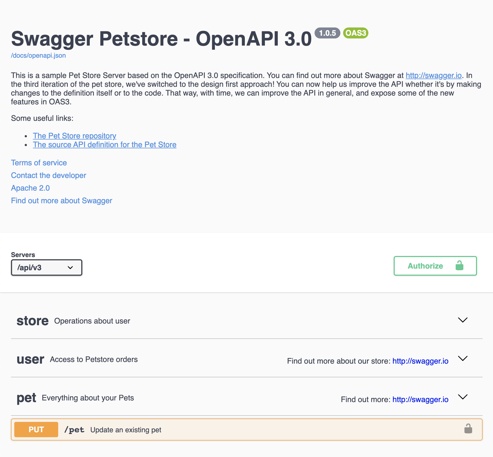
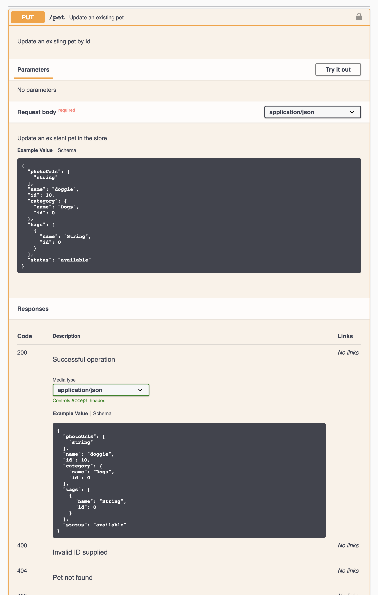

# OpenAPI Ktor

Generate a swagger document from your ktor application. See the 
[sample project](https://github.com/sultanofcardio/openapi-ktor-sample)

[](http://kotlinlang.org)
[](https://ktor.io/)
[](https://docs.gradle.org/6.7/userguide/userguide.html)
[](https://java.com/)
[](http://www.apache.org/licenses/LICENSE-2.0)

---

* [Installation](#installation)
    * [Maven](#maven)
    * [Gradle](#gradle)
* [Basic Usage](#basic-usage)
* [Options/Defaults](#options--defaults)
* [API]()

## Installation

Add the dependency to your pom.xml or build.gradle

> This project includes the ktor dependencies transitively, so you don't need
> to explicitly depend on it.

### Maven

```xml
<!-- Versions after 0.30.1 -->
<repositories>
    <repository>
        <id>sultanofcardio</id>
        <name>sultanofcardio</name>
        <url>https://repo.sultanofcardio.com/artifactory/sultanofcardio/</url>
    </repository>
</repositories>


<dependencies>
<dependency>
    <groupId>com.sultanofcardio</groupId>
    <artifactId>openapi-ktor</artifactId>
    <version>1.0.0-SNAPSHOT</version>
</dependency>
</dependencies>
```

### Gradle

```groovy
repositories {
    maven {
        url 'https://repo.sultanofcardio.com/artifactory/sultanofcardio'
    }
}

dependencies {
    implementation 'com.sultanofcardio:openapi-ktor:1.0.0-SNAPSHOT'
}
```

## Basic Usage

Install your routes inside an `openapi` block, instead of directly inside the
`routing` block. The syntax is exactly the same as vanilla ktor.

```kotlin
fun Application.module() {
    routing {
        openapi {
            get("/") {
                handle {
                    call.respondText("Hello world")
                }
            }
        }
    }
}
```

The ktor code that gets executed at runtime goes inside the `handle` block.

This example is using no explicit openapi features and does not generate a swagger document or swagger UI endpoint.

## Options / Defaults

Here's an example of using the `openapi` block with most of the optional configuration used.

```kotlin
// This block generally corresponds to the root OpenAPI object
// https://github.com/OAI/OpenAPI-Specification/blob/3.0.3/versions/3.0.3.md#oasObject
openapi {
    // Configure the info object
    // https://github.com/OAI/OpenAPI-Specification/blob/3.0.3/versions/3.0.3.md#infoObject
    info {
        version = "1.0.5"
        title = "Swagger Petstore - OpenAPI 3.0"
        description = """
            This is a sample Pet Store Server based on the OpenAPI 3.0 specification. You can find out more about Swagger 
            at [http://swagger.io](http://swagger.io). In the third iteration of the pet store, we've switched to the 
            design first approach! You can now help us improve the API whether it's by making changes to the definition 
            itself or to the code. That way, with time, we can improve the API in general, and expose some of the new 
            features in OAS3.
            
            Some useful links:
            - [The Pet Store repository](https://github.com/swagger-api/swagger-petstore)
            - [The source API definition for the Pet Store](https://github.com/swagger-api/swagger-petstore/blob/master/src/main/resources/openapi.yaml)
        """.trimIndent()
        termsOfService = "http://swagger.io/terms/"
        contact { email = "apiteam@swagger.io" }
        license(
            name = "Apache 2.0",
            url = "http://www.apache.org/licenses/LICENSE-2.0.html"
        )
    }
    externalDocs("http://swagger.io", "Find out more about Swagger")

    // Define tags that will later be applied to routes
    // https://github.com/OAI/OpenAPI-Specification/blob/3.0.3/versions/3.0.3.md#tag-object
    tag("store", "Operations about user")
    tag("user") {
        description = "Access to Petstore orders"
        externalDocs("http://swagger.io", "Find out more about our store")
    }
    val petTag = tag("pet") {
        description = "Everything about your Pets"
        externalDocs("http://swagger.io", "Find out more")
    }

    // Define an oauth2 flow. This is a valid ktor OAuthAuthenticationProvider configuration block
    // and can be used with the authorize method
    val petStoreAuth = oauth2("petstore_auth") { flows ->
        val url = "https://petstore3.swagger.io/oauth/"
        client = HttpClient(Apache)
        providerLookup = {
            OAuthServerSettings.OAuth2ServerSettings(
                name = "github",
                authorizeUrl = "$url/authorize",
                accessTokenUrl = "$url/access_token",
                clientId = "***",
                clientSecret = "***"
            )
        }
        urlProvider = { "" }
        flows.implicit {
            authorizationUrl = "$url/authorize"
            scopes {
                "write:pets" to "modify pets in your account"
                "read:pets" to "read your pets"
            }
        }
    }

    // https://github.com/OAI/OpenAPI-Specification/blob/3.0.3/versions/3.0.3.md#api-key-sample
    val apiKey = apiKey("api_key", ApiKeyLocation.header)

    // https://github.com/OAI/OpenAPI-Specification/blob/3.0.3/versions/3.0.3.md#basic-authentication-sample
    val sampleBasicAuth = basicAuth("sample") {
        validate {
            // Basic auth config that accepts all credentials
            object : Principal {}
        }
    }

    // Require basic authentication to access these routes
    authenticate(sampleBasicAuth) {
        // Serve swagger UI at the /docs route, protected by basic auth
        swaggerUI()
    }

    // https://github.com/OAI/OpenAPI-Specification/blob/3.0.3/versions/3.0.3.md#server-object
    server("/api/v3")

    // Include a route in the ktor hierarchy, but exclude it from the OpenAPI docs
    undocumentedRoute("/api/v3") {
        // Allow authentication by oauth2 or api key
        authenticate(petStoreAuth, apiKey) {
            route("/pet") {
                // PUT /api/v3/pet
                // This block allows you to configure the operation object
                // https://github.com/OAI/OpenAPI-Specification/blob/3.0.3/versions/3.0.3.md#operationObject
                put {
                    // Add a list of tags to the path operation
                    tags(petTag)
                    summary = "Update an existing pet"
                    description = "Update an existing pet by Id"
                    requestBody = RequestBody(
                        required = true,
                        description = "Update an existent pet in the store",
                        content = JsonContent(samplePet)
                    )
                    responses = {
                        response {
                            description = "Successful operation"
                            content = JsonContent(samplePet)
                        }

                        response(HttpStatusCode.BadRequest) {
                            description = "Invalid ID supplied"
                        }

                        response(HttpStatusCode.NotFound) {
                            description = "Pet not found"
                        }

                        response(HttpStatusCode.MethodNotAllowed) {
                            description = "Validation exception"
                        }
                    }
                    handle { call.respond(samplePet) }
                }
            }
        }
    }
}
```

This will produce a Swagger UI looking like this



with the pet operation looking like this


